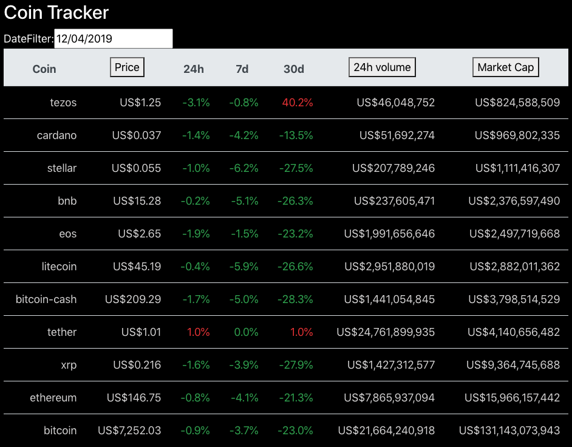

# Coin_Tracker
This is a single-page application that can help people track cryptocurrency prices. 
It is created with the MongoDB, Express.js, React.js, Node.js (MERN) stack.

## Demonstration
[Demo-Heroku(not deployed yet)]()
[Demo-AWS](http://3.19.53.239/)

* **Coin Tracker:** 

## Directory Structure
    Coin_Tracker
    ├── README.md
    │
    ├── frontend              
    │   └─── src 
    │        ├── index.js
    │        ├── App.js
    │        ├── package.json           # NPM Package file
    │        └── components             # React components
    │           
    │
    └── backend
        ├── server.js                 
        ├── populatedb.js               # Used to populate data to MongoDB
        ├── crypto_historical_data.csv  # Cryptocurrency historical data
        ├── package.json                # NPM Package file
        ├── .env                        # Environment variables file
        ├── routes                      # Backend routes files
        └── models                      # MongoDB schema files
		